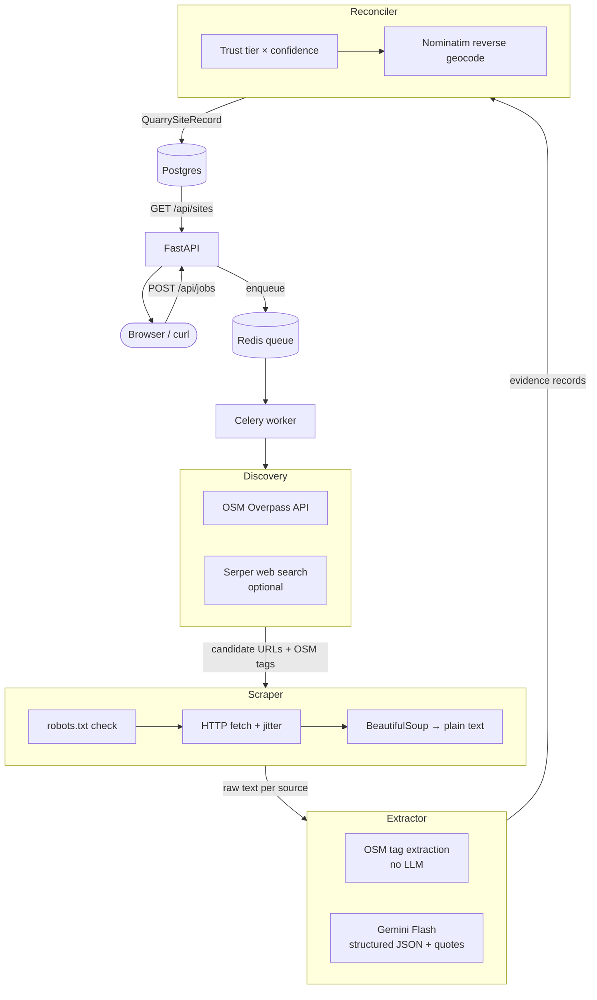

# ORIS Quarry Pipeline

Give it a GPS coordinate and a radius, it finds quarries nearby using OpenStreetMap, scrapes whatever public pages it can find, runs Gemini Flash over the text to pull out structured data, and saves everything to Postgres as JSON records with provenance.

---

## Getting started

```sh
# clone and go in
cd oris-quarry-pipeline

# create your env file
cp .env.example .env

# add your Gemini API key in .env (free at aistudio.google.com)
# GEMINI_API_KEY=AIza...

# build and start everything
docker compose up -d --build

# restart the worker so it picks up the key
docker compose restart worker

# open the UI in your browser
# http://localhost:3000

# submit a job straight from the terminal
curl -X POST http://localhost:8000/api/jobs \
  -H "Content-Type: application/json" \
  -d '{"latitude": 48.8566, "longitude": 2.3522, "radius_km": 50}'
```

If you prefer shortcuts, `make bootstrap`, `make test`, `make eval`, and `make extract` wrap the same Docker Compose flow.
On Windows PowerShell, use `Copy-Item .env.example .env` instead of `cp`.

| URL | What it is |
|-----|------------|
| `http://localhost:3000` | Frontend |
| `http://localhost:8000` | API |
| `http://localhost:8000/api/health` | Health check |

---

## How it works



Stack is FastAPI + Celery + Redis + Postgres + Nginx, all in Docker Compose.

### Why these choices

**OSM first**: Overpass is free and gives coordinates + tags out of the box. It's the main data source. Serper is optional and costs money so it's off by default.

**Sync Celery workers**: Easier to reason about than async for this kind of I/O-heavy work. Jitter between requests handles concurrency well enough without coroutines.

**Abstain over guess**: Gemini is told to return `null` + an `abstain_reason` when it's not sure. A blank field is better than a made-up one.

**Quote-based grounding**: Instead of asking the model to give character offsets (which it gets wrong), I ask for verbatim quotes and then find the positions in Python. Much more reliable.

**Trust tiers**: `official` (OSM, operator sites) beats `directory` beats `news`. Confidence score breaks ties within the same tier.

**Gemini Flash**: Free tier is 15 RPM and 1M tokens/day which is plenty for normal usage. Swapping models is just changing `GEMINI_MODEL` in `.env`.

---

## Talking to the backend

A few endpoints worth knowing:

- `POST /api/jobs` — kick off a new search. Body: `{ latitude, longitude, radius_km }`. Returns a `job_id` you can poll.
- `GET /api/jobs/:id` — check where a job is at (pending / running / completed / failed), progress 0–100, and how many sites came back.
- `GET /api/sites` — browse everything in the DB. Supports `?q=` to filter by name and `?status=` for operational status. Paginated.
- `GET /api/sites/:id` — full site record with all source evidence, confidence scores, model call logs.
- `GET /api/health` — quick sanity check: DB up, Redis up, queue depth, worker count, error rate.

---

## Evaluation

Three French quarries in `eval/ground_truth.json` used for scoring:

1. Carriere de Vignats (Calvados) - active limestone quarry
2. Carrieres du Boulonnais (Pas-de-Calais) - active limestone/chalk
3. Carriere de Rimont (Ariege) - marble quarry, status uncertain

```sh
make eval
# runs the scoring script against the live API
```

Script submits a job per location, waits up to 5 minutes, then scores the best matching site on name, status, and materials. Prints field-level breakdown + overall precision.

- Above 80%: working well
- 50-80%: probably missing web content or hitting rate limits
- Below 50%: check your API key and Docker network

---

## Tests

```sh
make test
```

Covers schema validation, abstain behaviour, OSM tag extraction, quote position finding, robots.txt enforcement, and smoke tests for all 5 API endpoints.

---

## Scraping rules

- Always checks robots.txt before fetching anything
- User-Agent: `OrisQuarryPipeline/1.0 (contact: pipeline@oris.example)`
- Random 0.5-2.0s sleep between fetches
- Respects Retry-After on 429s (capped at 120s)
- Blocks social media domains, validates redirects
- Reads max 500 KB per page, passes max 15k chars to the LLM

---

## Known issues / limitations

1. OSM coverage is patchy in some regions. Many quarries are unmapped or tagged differently.
2. JS-heavy sites dont work with requests/BeautifulSoup. Would need Playwright for those.
3. Operational status is hard to get right without recent dated evidence - the pipeline abstains in most cases.
4. robots.txt cache is in memory only, gets cleared on worker restart.
5. At 15 RPM on the free tier, big jobs (30+ sites) can hit rate limits. Falls back to OSM-only extraction if Gemini fails.

### Things I would add with more time

- Playwright for JS-rendered pages
- Redis-based robots.txt cache that survives restarts
- Conservative web-only fallback discovery for regions where OSM is sparse
- Google Maps / Bing Places as additional discovery sources
- Server-Sent Events for live progress instead of polling
- Per-IP rate limiting in FastAPI
